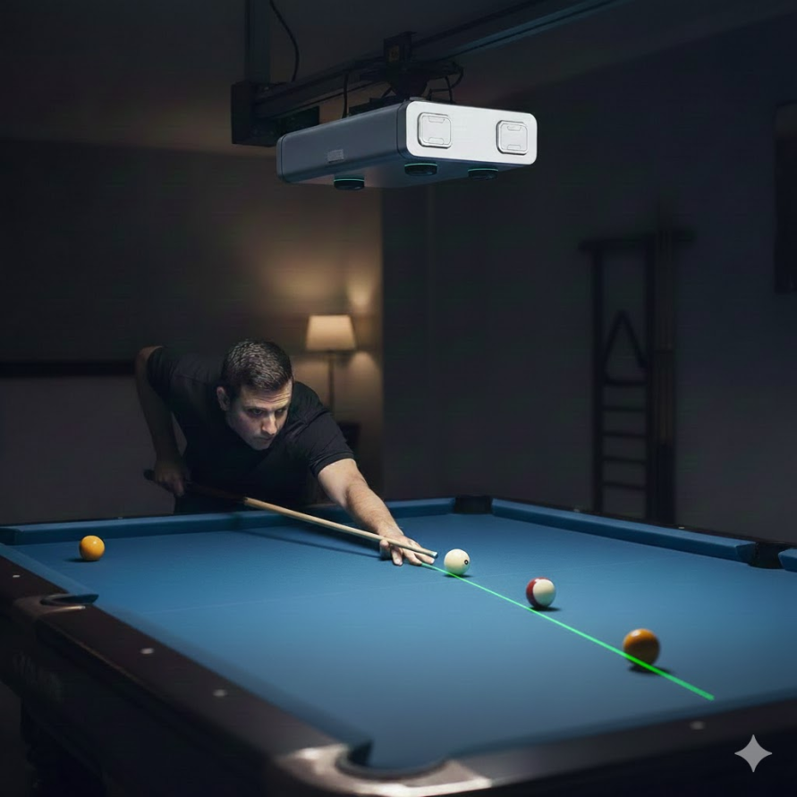
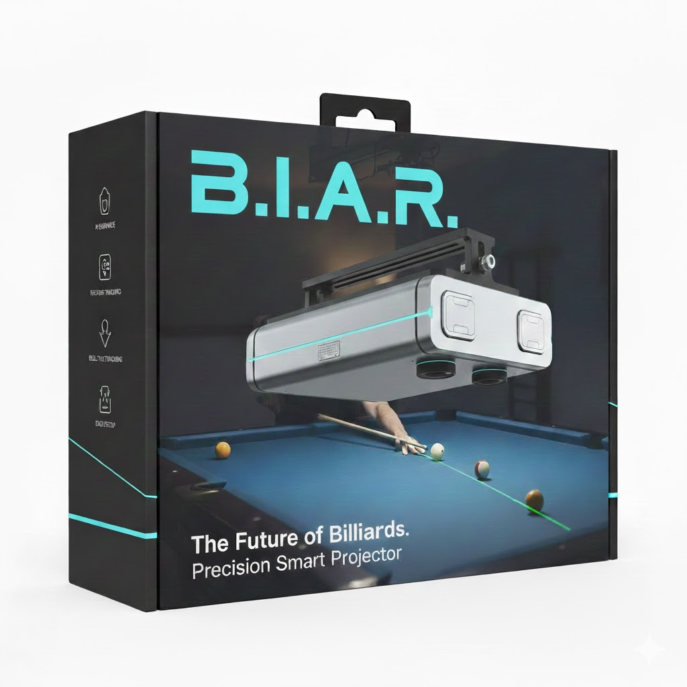

# B.I.A.R
---

## Smart Training System for Pool Players

---

## Vision

Transform traditional pool practice into an interactive, data-driven training experience using computer vision and real-time projection guidance.

---

## The Problem

Pool players face several challenges when practicing:

- Difficulty visualizing optimal shot angles and ball placement
- Limited feedback on technique and positioning
- Practicing alone without coaching guidance
- Inconsistent training methods for specific skills
- No objective measurement of improvement over time

---

## The Solution

A connected poolroom that combines:

- **Overhead camera system** for real-time table monitoring
- **Video projection** directly onto the playing surface
- **Computer vision** for ball detection and position analysis
- **Intelligent training algorithms** for personalized exercises

---

## How It Works

### 1. Detection
The overhead camera continuously monitors the table, detecting:
- Ball positions (solids, stripes, cue ball)
- Player positioning
- Cue stick angle and approach

### 2. Analysis
Computer vision algorithms process the scene to:
- Calculate optimal shot trajectories
- Identify best ball placement for exercises
- Evaluate current table setup difficulty

### 3. Projection
Visual guidance projected directly onto the table shows:
- Recommended aim points and target lines
- Ball placement zones for drills
- Ghost ball positions
- Expected ball paths after contact

---

## Key Features

### Training Modes

**Exercise Mode**
- Select from a library of classic pool drills
- System projects ideal ball placements on the table
- Visual feedback on setup accuracy
- Track completion rates and time

**Shot Analysis Mode**
- Real-time trajectory visualization
- Multiple shot option comparison
- Difficulty rating for each potential shot
- Strategic position play guidance

**Free Practice Mode**
- Optional guidance overlay
- Shot tracking and statistics
- Pattern recognition and suggestions

---

## Technology Stack

### Hardware
- High-resolution overhead camera (4K+)
- Short-throw projector or laser projector
- Edge computing device (for low-latency processing)
- Structured lighting (optional, for improved detection)

### Software
- Computer vision (OpenCV, custom ball detection)
- Physics engine for trajectory simulation
- Training exercise database
- Player progress tracking system
- Web interface for configuration and analytics

---

## Exercise Examples

### Straight-In Shots Drill
- System projects target ball positions at varying distances
- Player places balls matching the projection
- Practice fundamental stroke mechanics
- Tracks accuracy percentage

### Position Play Training
- System shows optimal leave positions
- Projects the "zone" where cue ball should land
- Analyzes actual results vs. target
- Builds positional awareness

### Pattern Recognition
- Common game scenarios projected on table
- Multiple solution paths shown on demand
- Helps develop strategic thinking
- Competitive timing mode available

---

## User Experience

### Setup Process
1. Player selects exercise from tablet/touch interface
2. System projects ball placement guides on table
3. Player arranges balls to match projection
4. System confirms setup and begins drill
5. Real-time feedback during execution

### Visual Interface
- Subtle, non-intrusive projection design
- Color-coded difficulty indicators
- Adjustable guidance intensity
- Toggle on/off during shots

---

## Benefits

### For Individual Players
- Accelerated skill development
- Objective performance metrics
- Personalized training paths
- Practice motivation and engagement

### For Pool Halls
- Differentiated premium offering
- Attract serious players and beginners
- Data-driven lane utilization
- Modern, tech-forward brand image

### For Instructors
- Enhanced teaching tools
- Objective student assessment
- Standardized drill delivery
- Remote coaching possibilities
